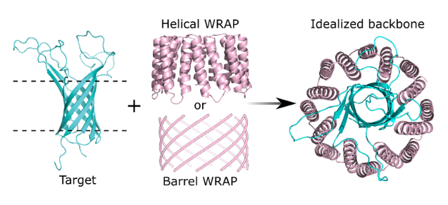

# sushimaki

## Description
This repo includes a script that generates helical or beta barrel WRAPs parametrically around a target protein to use as input for RF partial diffusion refinement.

## Reference
Ljubica Mihaljević et. al. Solubilization of Membrane Proteins using designed protein WRAPS. Submitted to Science.

## Installation
You can clone this repo into a preferred destination directory by going to that directory and then running:

`git clone https://github.com/davidekim/sushimaki.git`

## Usage
sushimaki.py is the main script that generates WRAPed inputs for RF partial diffusion structure refinement.

~~~
python ./sushimaki.py 2ge4A.pdb
python ./sushimaki.py --barrel 2ge4A.pdb
~~~

### Dependencies
PyRosetta [https://www.pyrosetta.org](https://www.pyrosetta.org)

BBQ [https://biocomp.chem.uw.edu.pl/tools/bbq](https://biocomp.chem.uw.edu.pl/tools/bbq)

DeepTMHMM [https://dtu.biolib.com/DeepTMHMM](https://dtu.biolib.com/DeepTMHMM)
pip3 install pybiolib

## Support
Contact David Kim (dekim@uw.edu) for any questions.

