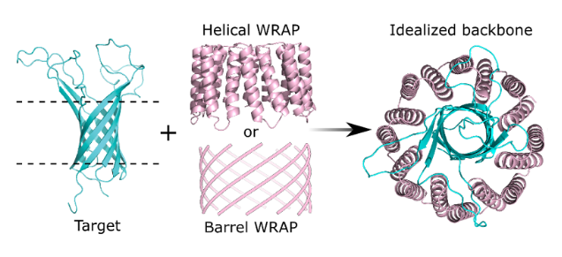

# sushimaki

## Description
This repo includes utility scripts to generate helical or beta barrel WRAPs parametrically around a target protein.

## References
Ljubica Mihaljević et al., Membrane protein solubilization and structure determination using de novo–designed proteins. Science 393, eadr3817 (2026). [DOI:10.1126/science.adr3817](https://www.science.org/doi/10.1126/science.adr3817)

Yong Hyun Kwon et. al. Topological reprogramming transforms an integral membrane oligosaccharyltransferase into a water-soluble glycosylation catalyst ([helix wrap](https://www.biorxiv.org/content/10.64898/2026.01.30.702934v1))

## Installation
We recommend running this package from a [Google Colab Notebook](https://colab.research.google.com/github/davidekim/sushimaki/blob/main/sushimaki.ipynb).

Alternatively, you can clone this repo into a preferred destination directory by going to that directory and then running:

`git clone https://github.com/davidekim/sushimaki.git`

### For a complete pipeline to generate backbone refined, sequence designed and AF2 validated WRAPs
Install the ppi_iterative_opt submodule for RF partial diffusion, ProteinMPNN + Rosetta FastRelax, and Alphafold2 protein-protein interaction design optimization.

~~~
cd sushimaki
git submodule init
git submodule update --remote
~~~

Complete the ppi_iterative_opt installation by following instructions at https://github.com/davidekim/ppi_iterative_opt and the websites of the dependencies.

### Dependencies

#### To generate input WRAPs for backbone refinement and sequence design

PyRosetta https://www.pyrosetta.org

BBQ https://biocomp.chem.uw.edu.pl/tools/bbq

DeepTMHMM https://dtu.biolib.com/DeepTMHMM

#### For backbone refinement, sequence design, and AF2 validation

RFDiffusion https://github.com/RosettaCommons/RFdiffusion

Protein MPNN https://github.com/dauparas/ProteinMPNN

Alphafold2 https://github.com/google-deepmind/alphafold

## Usage
sushimaki.py is the main script that generates inputs for RF partial diffusion structure refinement and Protein MPNN sequence design to generate WRAPs.

For helical input WRAPs
~~~
python ./sushimaki.py 2ge4A.pdb
~~~

For beta barrel input WRAPs
~~~
python ./sushimaki.py --barrel 2ge4A.pdb
~~~

For RF partial diffusion backbone refinement, ProteinMPNN sequence design, and Alphafold2 validation
~~~
python ./ppi_iterative_opt/ppi_iterative_opt.py *_WRAP_*pdb
~~~

## Support
Contact David Kim (dekim@uw.edu) for any questions.

## Authors and acknowledgment
This work was conceptualized and developed by David Kim (dekim@uw.edu) and Ljubica Mihaljevic (ljubim@uw.edu)

